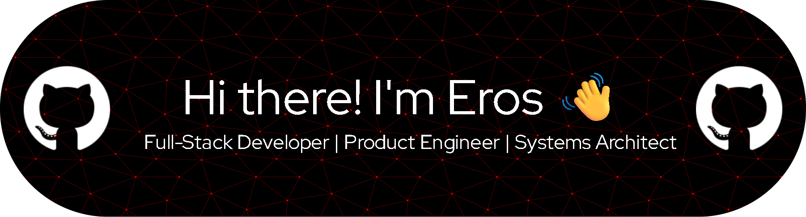

  
  
  

---

Software Engineer specialized in the intersection of **legacy systems and modern architectures**. My core strength lies in **Advanced Debugging & Troubleshooting** within critical environments—from desktop software and hybrid apps to AI implementations and cloud infrastructure management.

---

## 🛠️ Technical Expertise & Domains

  

| Domain | Key Capabilities |
| :--- | :--- |
| **Modern Stack** | **Next.js, Node.js, NestJS**, Prisma ORM, PostgreSQL, TypeScript. |
| **Hybrid & Legacy** | **PHP, VB6**, Web-to-Desktop Integrations, Cordova Mobile. |
| **AI & Data** | Autonomous Agents, **LLMs**, Vector Databases, RAG Workflows. |
| **DevOps & Admin** | **Remote Debugging (Android/Chrome)**, CPanel, Apache, Domain Mgmt. |
| **UI/UX Solutions** | MaterializeCSS, Internal SaaS Design for workflow optimization. |

### 🔍 Diagnostic Tooling

  
  
  
  

---

## 🧠 Value Proposition: "The Troubleshooter"

My focus goes beyond writing code; I optimize complex systems to ensure business continuity:

* **Critical Modernization:** Refactoring legacy logic (**VB6/PHP**) into modern, reactive interfaces without disrupting operations.
* **High-Level Debugging:** Diagnosing and resolving bottlenecks across multi-platform environments (Desktop, Web, and Mobile).
* **Solutions Engineering:** Designing and deploying internal tools (SaaS) to eliminate operational friction and technical debt.
* **Technical Leadership:** Mentoring upcoming talent while establishing high-quality engineering standards and best practices.
* **AI Strategy:** Implementing Large Language Models to automate internal processes and enhance existing product capabilities.

---

## 🏆 Achievements & Activity

  

  

---

## 🌐 Let's Connect

Looking for someone who masters the code of the past to build the AI-driven future? **Let's talk.**

  
  
  

  

